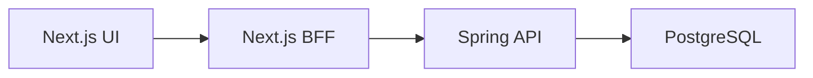
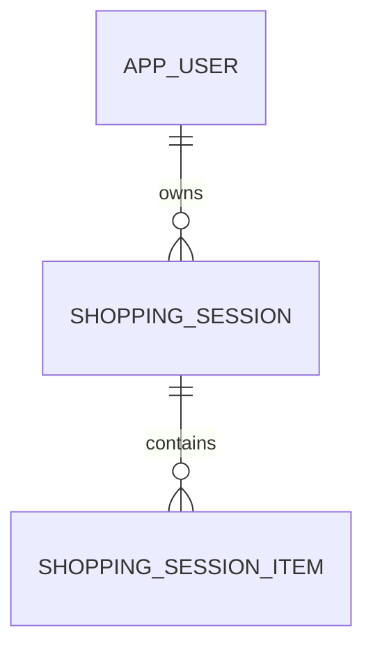

# MeuCarrinho API

Backend de estudo do MeuCarrinho. A API mantém sessões de compra e seus itens em PostgreSQL, aplica as regras do domínio e devolve valores monetários sem formatação de interface.



## Tecnologias

- Java 25
- Spring Boot 4.1
- Spring MVC, Spring Data JPA e Hibernate
- PostgreSQL e Flyway
- AWS SDK for Java v2 (S3) para fotos de etiqueta, com LocalStack no ambiente local
- Jakarta Bean Validation
- JUnit, AssertJ, Mockito, MockMvc e Testcontainers (PostgreSQL e LocalStack)
- Maven Wrapper

## Arquitetura

O código é organizado por funcionalidade (`user` e `session`) e mantém três responsabilidades diretas:

```text
Controller -> Service -> Spring Data Repository -> PostgreSQL
```

- Controllers cuidam de HTTP, validação e DTOs.
- Services aplicam regras, ownership, transações e cálculos.
- Repositories contêm apenas consultas de persistência.
- Flyway é o único responsável pela evolução do schema.
- A integração com armazenamento de objetos fica isolada em `common/storage` (`ObjectStorageService`); o banco guarda apenas a chave do objeto, nunca o binário da imagem.

As entidades JPA nunca são expostas diretamente. A listagem usa um DTO resumido sem itens; o detalhe usa outro DTO com os itens da sessão.

## Executando localmente

Pré-requisitos: JDK 25 e Docker com Compose.

```bash
docker compose up -d
./mvnw spring-boot:run
```

`docker compose up -d` sobe o PostgreSQL e o LocalStack (S3). O script
`local/localstack/ready.d/01-create-bucket.sh` cria o bucket `meucarrinho-media`
assim que o S3 fica pronto; na inicialização a aplicação também garante o bucket
(`S3BucketInitializer`).

A API fica em `http://localhost:8080/api/v1`, o PostgreSQL em `localhost:5432` e o
S3 do LocalStack em `http://localhost:4566`.

Se já houver um PostgreSQL nativo escutando em `localhost:5432`, o container não
consegue publicar a porta e a aplicação conecta no banco errado. Pare o serviço
nativo (`sudo service postgresql stop`) e rode `docker compose restart`, ou remapeie
a porta do container e ajuste `DB_URL`.

Configuração padrão:

```text
database: meucarrinho
username: meucarrinho
password: meucarrinho
```

As variáveis `DB_URL`, `DB_USERNAME` e `DB_PASSWORD` substituem esses valores. Para parar o banco sem apagar o volume:

```bash
docker compose down
```

No Docker Desktop para Windows, habilite a integração da distribuição WSL antes de executar os comandos.

## Flyway e dados demonstrativos

O Hibernate usa `ddl-auto: validate`: a aplicação falha se as entidades não corresponderem ao schema. Ela nunca cria ou atualiza tabelas.

- `V1__create_initial_schema.sql` cria tabelas, relacionamentos, constraints e índices.
- `V2__seed_demo_data.sql` cria o usuário `local-demo-user` e três sessões: uma ativa vazia, uma ativa com itens e uma concluída.
- `V3__rename_item_label_photo_to_key.sql` renomeia `shopping_session_item.label_photo_url` para `label_photo_key` (referência ao objeto no S3).

Enquanto não há autenticação, `CurrentUserService` resolve esse usuário fixo. Todas as consultas sensíveis recebem também o ID do usuário, preservando a fronteira de ownership para a futura adoção do subject de um JWT.

## Modelo de domínio



Há somente três tabelas:

- `app_user`: identidade do proprietário.
- `shopping_session`: nome, loja, orçamento e ciclo de vida.
- `shopping_session_item`: nome, preço unitário, quantidade, observação e a chave da foto da etiqueta no S3 (`label_photo_key`).

Exclusões de usuário e de sessão usam `ON DELETE CASCADE` nas chaves estrangeiras.

## Valores derivados

Totais e contagens não são persistidos:

```text
itemCount       = soma das quantidades
total           = soma de unitPrice * quantity
remainingBudget = budget - total
overBudget      = total > budget
```

Dinheiro usa `BigDecimal` no Java e `NUMERIC(12,2)` no PostgreSQL. As respostas retornam números crus, nunca textos como `R$ 10,00`.

## Armazenamento de objetos (S3)

Cada item pode ter uma foto da etiqueta. O upload passa pelo backend, que grava o
arquivo no S3 sob a chave `sessions/{sessionId}/items/{itemId}/{uuid}.{ext}` e guarda
apenas essa chave em `shopping_session_item.label_photo_key`. Clientes não enviam mais
URLs no corpo de criação/edição de item.

As respostas de item (`GET /sessions/{id}` e afins) trazem `labelPhotoKey` e um
`labelPhotoUrl` pré-assinado de curta duração, gerado sob demanda. O endpoint
`GET .../label-photo` devolve uma URL pré-assinada nova a cada chamada.

Configuração (`app.storage.s3.*`, com variáveis de ambiente entre parênteses):

```text
endpoint            (S3_ENDPOINT)             http://localhost:4566
region              (S3_REGION)               us-east-1
bucket              (S3_BUCKET)               meucarrinho-media
access-key          (S3_ACCESS_KEY)           test
secret-key          (S3_SECRET_KEY)           test
path-style-access   (S3_PATH_STYLE_ACCESS)    true
presign-ttl         (S3_PRESIGN_TTL)          15m
auto-create-bucket  (S3_AUTO_CREATE_BUCKET)   true
```

Os padrões servem o LocalStack local. Em produção, aponte `endpoint`/credenciais para
a AWS real e use `path-style-access: false` e `auto-create-bucket: false`.

Upload aceita `image/jpeg`, `image/png` e `image/webp` até 5 MB.

```bash
curl -X POST 'http://localhost:8080/api/v1/sessions/{sessionId}/items/{itemId}/label-photo' \
  -F 'file=@etiqueta.jpg;type=image/jpeg'
```

## Endpoints

| Método | Caminho | Comportamento |
| --- | --- | --- |
| `GET` | `/api/v1/sessions?status=ACTIVE|COMPLETED` | Lista resumos, mais recentes primeiro |
| `POST` | `/api/v1/sessions` | Cria sessão ativa |
| `GET` | `/api/v1/sessions/{sessionId}` | Retorna detalhe, itens e valores derivados |
| `PATCH` | `/api/v1/sessions/{sessionId}` | Altera nome, loja ou orçamento |
| `DELETE` | `/api/v1/sessions/{sessionId}` | Exclui sessão e itens |
| `POST` | `/api/v1/sessions/{sessionId}/complete` | Conclui sessão ativa |
| `POST` | `/api/v1/sessions/{sessionId}/duplicate` | Cria cópia ativa com novos UUIDs |
| `POST` | `/api/v1/sessions/{sessionId}/items` | Adiciona item e retorna detalhe atualizado |
| `PATCH` | `/api/v1/sessions/{sessionId}/items/{itemId}` | Altera item e retorna detalhe atualizado |
| `PATCH` | `/api/v1/sessions/{sessionId}/items/{itemId}/quantity` | Altera quantidade e retorna detalhe atualizado |
| `DELETE` | `/api/v1/sessions/{sessionId}/items/{itemId}` | Exclui item |
| `POST` | `/api/v1/sessions/{sessionId}/items/{itemId}/label-photo` | Faz upload (multipart `file`) da foto da etiqueta para o S3 e persiste a chave |
| `GET` | `/api/v1/sessions/{sessionId}/items/{itemId}/label-photo` | Retorna a chave e uma URL pré-assinada; `404` se o item não tem foto |
| `DELETE` | `/api/v1/sessions/{sessionId}/items/{itemId}/label-photo` | Remove o objeto do S3 e limpa a chave |
| `GET` | `/api/v1/me/stats` | Calcula estatísticas da conta |

Exemplo:

```bash
curl 'http://localhost:8080/api/v1/sessions?status=ACTIVE'

curl -X POST 'http://localhost:8080/api/v1/sessions' \
  -H 'Content-Type: application/json' \
  -d '{"name":"Compras 01/09","storeName":null,"budget":250.00}'
```

## Regras importantes

- Uma sessão nova sempre começa como `ACTIVE` e sem `completedAt`.
- Somente sessões ativas e seus itens podem ser alterados.
- Uma sessão concluída não pode ser concluída novamente.
- A conclusão e a duplicação são operações transacionais explícitas.
- Item deve ter nome, preço não negativo e quantidade mínima de 1.
- Sessão deve ter nome e orçamento não negativo.
- Um item é localizado dentro da sessão informada e uma sessão dentro do usuário atual.
- Erros HTTP usam `ProblemDetail`: validação retorna `400`, recurso ausente `404` e conflito de ciclo de vida `409`.

## Testes

```bash
./mvnw test
./mvnw verify
```

A suíte contém testes de services, cálculos derivados, ownership, validação e respostas HTTP com MockMvc. Os testes marcados com Testcontainers executam as migrações, a validação JPA e mutações reais contra PostgreSQL; se Docker não estiver disponível, esses testes são ignorados pelo JUnit.

## Deploy no Google Cloud Run

Este repositório tem um workflow em `.github/workflows/deploy-cloud-run.yml` que reconstrói a imagem Docker e faz deploy no Cloud Run a cada push na branch `main`.

Infra esperada:

- projeto GCP: `onias-shopping-cart-dev`
- região: `southamerica-east1`
- serviço Cloud Run: `meucarrinho-api`
- Artifact Registry: `southamerica-east1-docker.pkg.dev/onias-shopping-cart-dev/meucarrinho/meucarrinho-api`
- service account de deploy: `meucarrinho-api-deployer@onias-shopping-cart-dev.iam.gserviceaccount.com`
- service account de runtime: `meucarrinho-api-runtime@onias-shopping-cart-dev.iam.gserviceaccount.com`

O workflow usa Workload Identity Federation, sem chave JSON estática. Antes do primeiro deploy, aplique a stack de projetos em `onias-cloud-bootstrap` e preencha estas secrets no Secret Manager do projeto `onias-shopping-cart-dev`:

```text
meucarrinho-db-url
meucarrinho-db-username
meucarrinho-db-password
meucarrinho-aws-access-key-id
meucarrinho-aws-secret-access-key
```

As variáveis S3 fixas do deploy apontam para o bucket real da AWS criado para o app: `meucarrinho-media-215038507309-sa-east-1` em `sa-east-1`.
