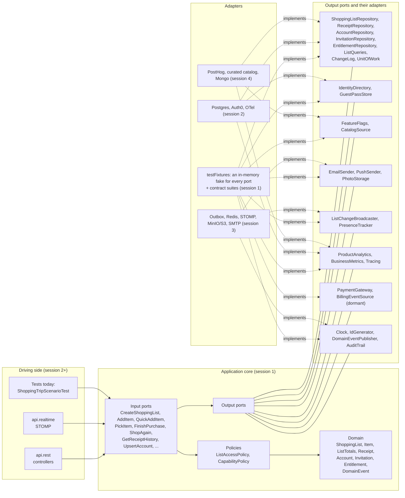

# Architecture

Hexagonal: the core (domain and application) knows no framework or vendor, and everything
outside talks to it through ports it owns. Arrows point in the direction of dependency;
adapters depend on ports, never the reverse. The rules are enforced by
`src/test/java/app/meucarrinho/architecture/ArchitectureTest.java`.

## Packages

| Package | Holds | May depend on |
|---|---|---|
| `domain` | Aggregates, value objects, domain events, `QuickAddParser` | JDK, JSpecify |
| `application.<capability>` | Input ports and their services; output ports in `port` | `domain`; other capabilities only through their `api` subpackage; `application.common` and `application.telemetry.port` (ADR 0002) |
| `api.rest`, `api.realtime` | Controllers (session 2) | Input ports only |
| `adapter.<concern>.<vendor>` | One port implementation each (session 2+) | Ports, domain, its own vendor SDK |
| `bootstrap` | `main()`, adapter selection | Everything |

## What each session adds

| Session | Adds |
|---|---|
| 1 | Skeleton, ArchUnit rules, domain, every port, fakes and contract suites, use cases, scenario test |
| 2 | Postgres adapter and Flyway, REST API and Problem Details, OpenAPI, Auth0 and mock auth, OTel traces, health probes, seed data |
| 3 | Outbox listeners, op-log sync and guest import, invitations and guest passes, realtime, photos on MinIO, e-mail to Mailpit, capability checks at the edges |
| 4 | Product events and PostHog, telemetry ingest, dashboards, PostHog flags, curated catalog, audit trail, LGPD endpoints, resilience, Mongo adapter |
