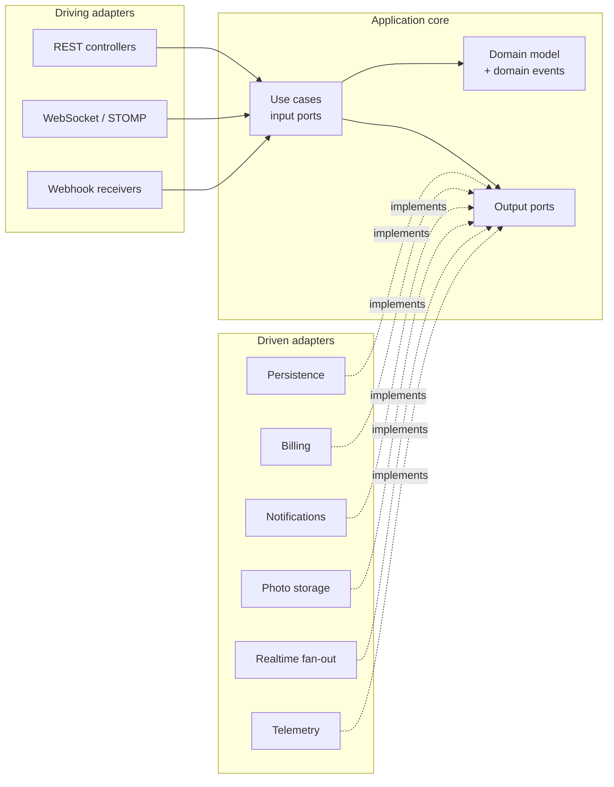
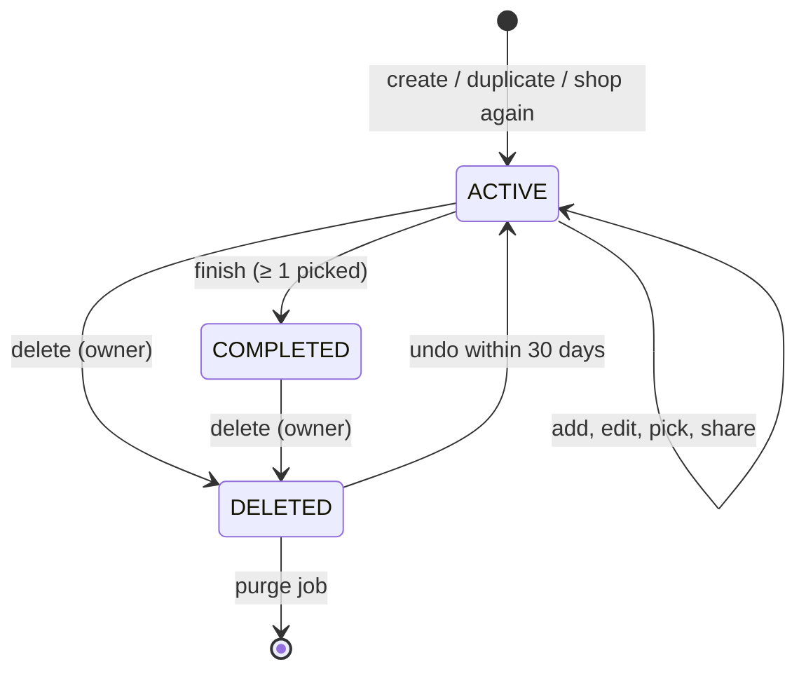
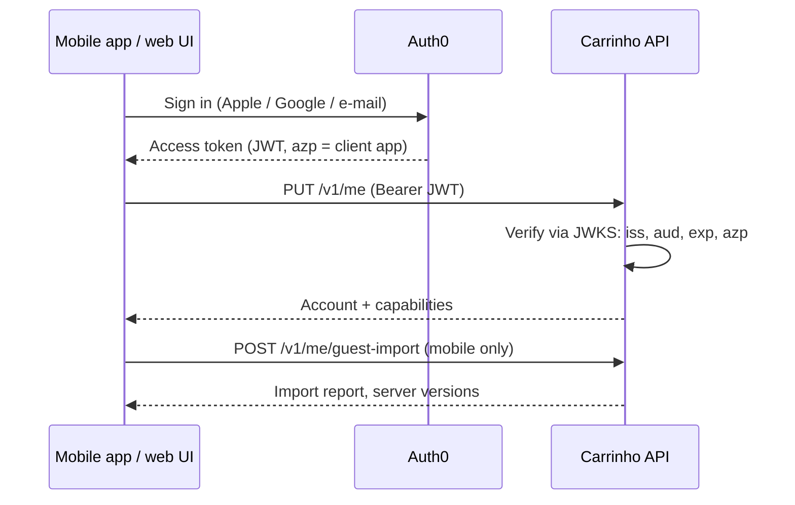
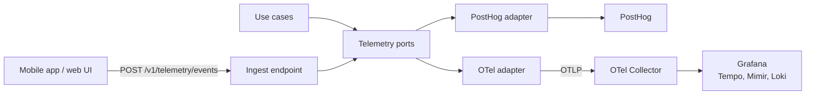

# Meu Carrinho API | V1 — Backend spec

The complete backend specification for Meu Carrinho API v1, one section per former Notion page (§1–§15). Every LLM session reads these sections.

> In one line: an offline-first sync and collaboration service in Java 25 and Spring Boot 4.1, where every vendor (database, identity, billing, e-mail, storage, realtime, telemetry) sits behind a domain-owned port and is swapped by one property.

_Source: Notion hub "Meu Carrinho API | V1" › Backend spec, exported 2026-09-25._

## Contents

1. Overview
2. Tech stack and versions
3. Architecture
4. Domain model
5. Ports
6. Authentication
7. API surface
8. Offline sync and conflicts
9. Observability as product
10. Swapping providers
11. Testing and architecture fitness
12. Security, privacy and operations
13. Errors, safety and operations
14. Developer experience and local stack
15. Roadmap and decisions

---

## 1. Overview

The backend is a sync-and-collaboration service for an offline-first mobile app: the phone stays the source of truth for guests, and the server adds backup, multi-device, live shared lists, receipts and history once a user signs in. Every external concern (database, identity, billing, e-mail/push, file storage, realtime fan-out, telemetry) sits behind a domain-owned interface, so any vendor can be swapped by changing one adapter package and one config key.

What the prototype asks of the backend:

| Prototype behaviour | Backend capability |
|---|---|
| Guest mode, lists live only on the device | No server calls needed; client queues ops locally and uploads them on first sign-in (guest import) |
| Sign in with Apple, Google or e-mail; "your lists go with you" | Managed identity provider (Auth0) + idempotent guest-data import |
| Lists with name, store, optional budget; active vs finished | `ShoppingList` aggregate with lifecycle `ACTIVE → COMPLETED` |
| Items: name, qty, unit (un/kg), price, note, photo, who edited last | `Item` entity with `lastEditedBy`, photo via object storage |
| Quick add "2 leite 5,49" + catalog suggestions + frequent items | Server-side parser parity, catalog/price-memory endpoint, per-user frequency stats |
| "Comprar junto": code 4K7Q, share link, members online | Invitations with short codes, members who are accounts or guests, presence over realtime channel |
| Live edits by Jessica/Onias with toasts and highlights | Realtime item events fanned out to list members |
| Offline banner, "Tentar" / "Tudo sincronizado" | Op-log sync endpoint with per-list versions and conflict resolution |
| Finish purchase: total, budget diff, unpicked items dropped | Immutable `Receipt` snapshot created on completion |
| History grouped by month, monthly totals, "Comprar de novo" | Read-model queries + clone-from-receipt command |
| Duplicate list, import items from last purchase, undo on delete | Commands with soft delete and a restore window |
| Preferences: sort order, collaboration alerts, haptics, currency BRL | `UserPreferences` synced per account |

Two clients use the API: the mobile app with the full feature set, and a web UI with a reduced one. Which capabilities a client gets (offline sync, more than 10 photos, and future advanced features) is decided by feature flags, not by a paid plan. There is no premium tier: the billing port stays defined with no active adapter, so Stripe or another provider can be plugged in later without touching the domain. Out of scope: price comparison across stores, barcode scanning, and currencies other than BRL.

---

## 2. Tech stack and versions

Target Java 25 (LTS) on Spring Boot 4.1.x / Spring Framework 7.0.x. Spring Boot has no LTS designation: every minor gets 12 months of OSS support, so the plan is to ride the newest minor and upgrade every six months ([HeroDevs, Jul 2026](https://www.herodevs.com/blog-posts/spring-boot-versions-eol-dates-and-latest-releases-april-2026)). Java 25 is the current LTS; the next, Java 29, is planned for September 2027 ([Oracle Java SE roadmap](https://www.oracle.com/br/java/technologies/java-se-support-roadmap.html)).

| Layer | Choice | Version / note |
|---|---|---|
| Language / runtime | Java, Eclipse Temurin JDK | 25 LTS; virtual threads on by default for request handling |
| Framework | Spring Boot on Spring Framework 7 | 4.1.x (4.1.0 shipped June 10, 2026); 4.2 expected Nov 2026 |
| Modularity | Spring Modulith | Event publication registry only: a transactional outbox for domain events. Boundaries are enforced by ArchUnit (§11) |
| Web | Spring MVC + `RestClient` / `@HttpExchange` | API versioning via Boot 4 built-in support; Problem Details (RFC 9457) errors |
| Security | Spring Security 7, OAuth2 Resource Server | Validates Auth0 JWTs plus list-scoped guest tokens; no passwords stored |
| Realtime | Spring WebSocket + STOMP | Behind the `ListChangeBroadcaster` and `PresenceTracker` ports; broker relay swappable |
| Persistence (default adapter) | PostgreSQL 17 + Spring Data JDBC + Flyway | JPA avoided in the domain; adapter could be JPA, jOOQ or Mongo instead |
| Cache / presence | Redis (Valkey-compatible) | Presence TTLs, rate limits, idempotency keys |
| Object storage | S3-compatible (AWS S3, R2, MinIO local) | Item photos via presigned URLs |
| Telemetry | Micrometer Observation API + OpenTelemetry (OTLP) | Boot 4.1 improves OTel support for traces, metrics and logs; exported to Grafana (Tempo, Mimir, Loki); product events to PostHog |
| JSON | Jackson 3 | Boot 4 default |
| Null-safety | JSpecify annotations | Enforced with NullAway in CI |
| Build | Gradle (Kotlin DSL), version catalog | One repo, one Gradle module; layers and adapters are packages (see §3) |
| Tests | JUnit 5, AssertJ, Testcontainers, ArchUnit | Contract tests shared by every adapter of a port |
| Packaging | OCI image via Buildpacks; optional GraalVM native | CDS/AOT cache for fast cold start |

Choosing Java 25 over the non-LTS JDK 26/27 trades a few language previews for a support window through at least September 2030.

---

## 3. Architecture

Hexagonal (ports and adapters) with one hard rule: dependencies point inward, and the domain and application layers compile without Spring, SQL, Stripe, PostHog, Grafana or any vendor SDK on their imports. Every capability the core needs from the outside world is an interface the core owns and names in its own language; every vendor lives in exactly one adapter package that implements it.



Arrows show dependencies: adapters depend on core ports, never the reverse.

### Interface-first rules

1. Every use case is an input-port interface (`CreateShoppingList`, `FinishPurchase`) with a single implementation in `application`. Controllers depend only on the interface.
2. Controllers are themselves defined by an interface annotated with the HTTP contract (`ShoppingListApi` with `@HttpExchange`-style mapping); the `@RestController` implements it. The same interface generates the OpenAPI document and a typed Java client for tests.
3. Output ports are named for what the domain needs, not what the vendor offers: `PaymentGateway.startCheckout(...)`, never `StripeClient`; `ProductAnalytics.track(ProductEvent)`, never a vendor SDK type.
4. Port signatures use only domain types, JDK types and the shared `Result<T, E>` type. No vendor exception, ID format or DTO crosses a port. Vendor IDs are stored as opaque `ExternalRef(provider, value)`.
5. Adapters translate errors into port-level sealed error types (`PaymentError.CardDeclined`, `NotificationError.Undeliverable`), so the core never catches `StripeException`.
6. An adapter is selected by one property per port (`carrinho.adapters.billing=stripe`) using an `@ConditionalOnProperty` configuration class inside the adapter package. The core never names an adapter.
7. Each port ships an in-memory fake in `testFixtures` plus an abstract contract test that every real adapter must pass (see §11).

### Repository and package layout

One repository, one Gradle module, one deployable image. Layers and adapters are packages under `app.meucarrinho`, and ArchUnit enforces the dependency rules as ordinary unit tests (§11). If a boundary ever needs compile-time enforcement, that package moves into a Gradle subproject in the same repo without changing any code.

```plain text
carrinho-backend/
├── build.gradle.kts · settings.gradle.kts · gradle/libs.versions.toml
├── compose.yaml · Makefile · Dockerfile
├── openapi/carrinho-v1.yaml
├── config/flags.local.yaml
├── docs/adr/
└── src/
    ├── main/java/app/meucarrinho/
    │   ├── domain/                 aggregates, value objects, domain events
    │   ├── application/            use cases, input ports, output ports
    │   │   └── lists/ sharing/ receipts/ catalog/ accounts/
    │   │       capabilities/ billing/ notifications/ sync/ telemetry/
    │   ├── api/
    │   │   ├── rest/               API interfaces, controllers, DTOs, problems
    │   │   └── realtime/           STOMP endpoints, presence
    │   ├── adapter/
    │   │   ├── persistence/postgres/   persistence/mongo/
    │   │   ├── identity/auth0/
    │   │   ├── flags/posthog/          flags/fixed/
    │   │   ├── catalog/curated/
    │   │   ├── billing/stripe/         (dormant)
    │   │   ├── notifications/resend/   notifications/smtp/   notifications/fcm/
    │   │   ├── storage/s3/
    │   │   ├── realtime/stomp/
    │   │   └── telemetry/otel/         telemetry/posthog/
    │   └── bootstrap/              main(), adapter selection, decorators
    ├── main/resources/db/migration/   Flyway scripts
    ├── test/                       unit, use-case, ArchUnit and API tests
    ├── testFixtures/               in-memory fakes and port contract suites
    └── integrationTest/            Testcontainers runs of every adapter
```

| Package | Contains | May depend on |
|---|---|---|
| `domain` | Aggregates, value objects, domain events, domain services | JDK, JSpecify only |
| `application.<capability>` | Input ports, use-case services, output ports (`port` subpackage) | `domain`; other capabilities only through their `api` subpackage or events |
| `api.rest`, `api.realtime` | API interfaces, controllers, DTOs, Problem Details, STOMP endpoints | Input ports in `application`, Spring Web / WebSocket |
| `adapter.<concern>.<vendor>` | One port implementation plus its `@Configuration`, e.g. `adapter.persistence.postgres` | `application` ports, `domain` types, that vendor's SDK |
| `bootstrap` | `main()`, profiles, adapter selection, observability decorators | Everything |

The main class lives in `bootstrap` and scans `app.meucarrinho`. Every adapter's `@Configuration` is guarded by `@ConditionalOnProperty`, so all vendor SDKs share one classpath but only the selected adapter's beans exist at runtime. Inside `application`, capabilities (`lists`, `sharing`, `receipts`, `catalog`, `accounts`, `capabilities`, `billing`, `notifications`, `sync`, `telemetry`) talk only through published domain events or each other's `api` subpackage.

---

## 4. Domain model

Five aggregates carry the product: `ShoppingList` (with its items), `Receipt`, `Account`, `Invitation` and `Entitlement`. All IDs are client-generatable UUIDv7, so a guest phone can create lists and items offline and the server accepts them unchanged.

### Value objects

| Type | Shape | Rules |
|---|---|---|
| `Money` | `long minorUnits` plus `CurrencyCode` | BRL only; the currency field stays so amounts are never ambiguous; never `double`; totals computed in the domain, not the client |
| `Quantity` | `BigDecimal` (scale 3) + `Unit` | `UN` ≥ 1 and integral; `KG` ≥ 0.1, step 0.1 as in the editor stepper |
| `ItemName` | `String` | Trimmed, 1–120 chars; `normalized()` strips accents and case for search/matching ("Café" = "cafe") |
| `StoreName` | `String` | Optional, ≤ 80 chars; free text, with recent stores suggested per user |
| `Budget` | `Money` | Optional; must be > 0 when set |
| `ShareCode` | 4 chars, Crockford base32 | Unique among active invitations; e.g. `4K7Q` |
| `ActorRef` | `AccountId` or `DeviceId` | Who made a change (an account, an invited guest via GuestId, or a device during guest import); drives the avatar on items and in toasts |
| `ExternalRef` | `provider` plus `value` | Opaque vendor IDs (Stripe customer, IdP subject) |

### Aggregates

| Aggregate | Key fields | Invariants |
|---|---|---|
| `ShoppingList` | id, ownerId, name, store, budget, status, members, items, version, createdAt, completedAt | Items editable only while `ACTIVE`; any member edits items; only the owner renames, deletes or removes members; members are accounts or invited guests, and guests may only edit items; max 10 members, 500 items |
| `Item` (entity in list) | id, name, quantity, unitPrice, note (≤ 280), photoRef, picked, pickedBy, lastEditedBy, position | Price ≥ 0 or absent ("+ preço"); subtotal = quantity × unitPrice |
| `Receipt` | id, listId, name, store, completedAt, participants, lines, total, budget, budgetDelta | Immutable; lines copied only from picked items; created only by `FinishPurchase` |
| `Account` | id, identity (`ExternalRef`), displayName, email, preferences, createdAt, deletedAt | One account per IdP subject; preferences: sort `ADDED`/`AZ`, collaboration alerts, haptics; currency fixed to BRL |
| `Invitation` | code, listId, createdBy, expiresAt, maxUses, uses | Expires after 7 days by default; revocable by owner |
| `Entitlement` | accountId, plan, status, validUntil, source (`ExternalRef`) | Dormant: there is no paid plan. If one is added, billing webhooks write it and it becomes one more input to `CapabilityPolicy` (§5) |

Derived values (never stored as source of truth): picked total, estimated total, remaining budget, over-budget flag, pending count. They are computed by `ListTotals` in the domain and returned in read models, so every client shows the same numbers.



Finishing drops unpicked items from the receipt, as the prototype's finish sheet warns; the list itself keeps them for "Comprar de novo".

### Domain events

Published through the Spring Modulith outbox so they survive crashes and feed realtime fan-out, notifications and telemetry from one source: `ListCreated`, `ListDuplicated`, `ListShoppedAgain`, `ItemAdded`, `ItemEdited`, `ItemPicked`, `ItemUnpicked`, `ItemRemoved`, `ItemRestored`, `BudgetExceeded`, `PurchaseFinished`, `InvitationCreated`, `MemberJoined`, `MemberLeft`, `GuestDataImported`, `AccountDeleted`, `EntitlementChanged`.

---

## 5. Ports

The core declares the output ports below; each has one production adapter today, an in-memory fake, and a contract test. Nothing below mentions SQL, Stripe, an e-mail vendor or an APM tool.

| Port | Purpose | Default adapter | Swap candidates |
|---|---|---|---|
| `ShoppingListRepository`, `ReceiptRepository`, `AccountRepository`, `InvitationRepository`, `EntitlementRepository` | Aggregate persistence by ID, optimistic locking on `version` | Postgres (Spring Data JDBC) | MongoDB, DynamoDB, Firestore |
| `ListQueries` | Read models: home cards, history by month, recent stores | Postgres views | Same store or a separate read DB |
| `ChangeLog` | Append-only per-list op log for sync (§8) | Postgres table | Any ordered log store |
| `UnitOfWork` | Transaction boundary without Spring annotations in the core | `TransactionTemplate` | Mongo sessions |
| `IdentityDirectory` | Delete or disable an identity at the IdP; read profile | Auth0 Management API (§6) | Clerk, Cognito, Firebase, Keycloak |
| `GuestPassStore` | Issue, verify and revoke list-scoped guest tokens (§6) | Postgres + Redis cache | Any key-value store |
| `FeatureFlags` | Evaluate a flag for a subject and client | PostHog | flagd, Unleash, LaunchDarkly, static config |
| `CatalogSource` | Item suggestions, categories, last known prices | Curated catalog (Postgres) | Crowd-sourced source, external price APIs |
| `EmailSender`, `PushSender` | Deliver a rendered domain `Notification` | Resend / FCM+APNs | SES, SendGrid, Postmark, OneSignal |
| `PhotoStorage` | Presigned upload/read URLs, deletion | S3 | R2, GCS, MinIO |
| `ListChangeBroadcaster`, `PresenceTracker` | Fan out item changes; who is online in a list | STOMP + Redis | Ably, Pusher, SSE |
| `ProductAnalytics` | Product events (§9) | PostHog | Amplitude, Mixpanel, OTel logs to any vendor |
| `BusinessMetrics`, `Tracing` | Metrics and spans (§9) | OpenTelemetry → Grafana | Datadog, Honeycomb, New Relic |
| `PaymentGateway`, `BillingEventSource` | Checkout, portal, webhooks | None active (no paid plan) | Stripe, Mercado Pago, Pagar.me, RevenueCat |

Plus two trivial ports that keep tests deterministic: `Clock` and `IdGenerator`.

### Capabilities and feature flags

The mobile app and the web UI share one API but not one feature set, and there is no paid plan: advanced features are gated by feature flags evaluated per client. The core asks a domain question ("may this actor, on this client, use this capability?") and never names the flag vendor.

```java
// application.capabilities
public enum Capability { OFFLINE_SYNC, GUEST_IMPORT, PHOTOS_BEYOND_BASE_LIMIT /* future advanced features */ }

public record ClientContext(ClientPlatform platform, AppVersion version, InstallId install) {}

public interface FeatureFlags {                     // output port
    boolean isEnabled(FlagKey key, FlagSubject subject, boolean fallback);
}

public interface CapabilityPolicy {                 // decides; the only caller of FeatureFlags
    Set<Capability> resolve(ActorRef actor, ClientContext client);
    Result<Void, CapabilityUnavailable> require(ActorRef actor, ClientContext client, Capability capability);
}
```

| Capability | Mobile default | Web default | Enforced at |
|---|---|---|---|
| `OFFLINE_SYNC` | On | Off | `/sync`, `/changes`; web works online-only through plain REST |
| `GUEST_IMPORT` | On | Off | `/me/guest-import` (web has no local guest store) |
| `PHOTOS_BEYOND_BASE_LIMIT` | On | Off | `/photos`: without it, uploads stop at 10 photos per list |

The client platform comes from Auth0's `azp` claim (one Auth0 application per client), so a web session cannot claim to be mobile; the `X-Carrinho-Client` header only adds app version. Flags are evaluated locally from a cache refreshed every 60 s; if the flag service is down, compiled defaults from the table above apply. `GET /v1/me/capabilities` returns the resolved set so each client hides what it cannot use, and a blocked call returns `403 CAPABILITY_UNAVAILABLE` plus a `capability_denied` telemetry event. A future paid plan would feed `Entitlement` into the same `CapabilityPolicy`, with no change to call sites.

### Catalog

Suggestions and last known prices come from a `CatalogSource` port. v1 ships `CuratedCatalog`: a Postgres table seeded from a versioned, hand-reviewed CSV, with accent-insensitive prefix search and a category per entry (used by telemetry in §9). A `CompositeCatalogSource` merges sources by priority, so a crowd-sourced source fed by `PurchaseFinished` events (with consent) can be added later as one more adapter, with no API or use-case change.

### Port style, by example

```java
// application.billing.port.PaymentGateway
public interface PaymentGateway {
    Result<CheckoutSession, PaymentError> startCheckout(AccountId account, PlanId plan, ReturnUrls urls);
    Result<PortalSession, PaymentError> openBillingPortal(AccountId account);
    Result<Void, PaymentError> cancel(AccountId account, CancelMode mode);
}

public sealed interface PaymentError {
    record ProviderUnavailable(String reason) implements PaymentError {}
    record CustomerNotFound(AccountId account) implements PaymentError {}
    record Rejected(String userMessageKey) implements PaymentError {}
}

// Webhooks: the adapter verifies the signature and translates; the core only sees domain events.
public interface BillingEventSource {
    Result<Optional<BillingEvent>, WebhookError> translate(RawWebhook request);
}
public sealed interface BillingEvent {
    record SubscriptionActivated(AccountId account, PlanId plan, Instant validUntil, ExternalRef ref) implements BillingEvent {}
    record SubscriptionLapsed(AccountId account, ExternalRef ref) implements BillingEvent {}
}
```

```java
// application.notifications.port.EmailSender
public interface EmailSender {
    Result<DeliveryId, NotificationError> send(EmailAddress to, Notification notification, Locale locale);
}

// Notifications are domain facts; templates are rendered by a NotificationRenderer the core owns,
// so switching vendor never changes copy.
public sealed interface Notification {
    record ListInvitation(ListName list, DisplayName inviter, ShareLink link) implements Notification {}
    record ReceiptCopy(ReceiptId receipt) implements Notification {}
    record Welcome(DisplayName name) implements Notification {}
}
```

```java
// application.lists.port.ShoppingListRepository
public interface ShoppingListRepository {
    Optional<ShoppingList> findById(ListId id);
    ShoppingList save(ShoppingList list);          // throws ConcurrentModification on stale version
    List<ShoppingList> findActiveForMember(AccountId member);
}

public interface UnitOfWork {
    <T> T execute(Supplier<T> work);
}
```

### Adapter selection

```yaml
carrinho:
  adapters:
    persistence: postgres     # postgres | mongo | memory
    identity: auth0           # auth0 | firebase | keycloak
    flags: posthog            # posthog | flagd | static
    catalog: curated          # curated | composite
    billing: none             # none | stripe | mercadopago
    email: resend             # resend | ses | log
    push: fcm
    storage: s3
    realtime: stomp-redis
    analytics: posthog        # posthog | otel-logs | log
    telemetry: otel           # OTLP to the Collector, which exports to Grafana
```

Each adapter package contributes one `@Configuration` class guarded by `@ConditionalOnProperty` on its key, with `matchIfMissing = false`. Startup fails fast if a port has zero or two beans, so a misconfigured swap cannot silently fall back.

---

## 6. Authentication

The backend never handles passwords, social-login flows or sessions: Auth0 does, and the API is a stateless OAuth2 resource server that trusts signed Auth0 JWTs. The one narrow exception is a list-scoped guest pass for people who join a shared list without an account. Auth0 covers the prototype's three buttons (Apple, Google, passwordless e-mail) with native SDKs and one Auth0 application per client (iOS, Android, web); Firebase, Clerk, Cognito or Keycloak slot into the same port.

### Flow



The app upserts its account, then uploads whatever it built as a guest, so "As listas que você já fez vão junto" holds.

### What lives where

| Concern | Owner | Detail |
|---|---|---|
| Credentials, MFA, social providers, e-mail links | Identity provider | Configured in the IdP console; no code in the backend |
| Token validation | Spring Security OAuth2 Resource Server | `issuer-uri` and audience from config; JWKS cached and rotated |
| Claim mapping | `adapter.identity.auth0` | A `PrincipalMapper` turns provider claims into `AuthenticatedPrincipal(ExternalRef subject, email, emailVerified, displayName)`; the only vendor-aware code |
| Account provisioning | `accounts` capability | `PUT /v1/me` is idempotent: one `Account` per (provider, subject) |
| Authorization | Domain | `ListAccessPolicy` decides owner vs member vs none from the aggregate, not from token scopes |
| Account deletion | `accounts` plus `IdentityDirectory` | `DELETE /v1/me` soft-deletes data, then deletes the IdP identity; required by App Store rules |
| Linking a second provider | Identity provider | Same subject keeps the same `Account` |

### Guest mode

Guests who only use their own lists make no authenticated calls: lists, receipts and preferences live in the app's local store, as the prototype's "Suas listas estão só neste aparelho" states. Two server touchpoints still exist for guests: the public catalog/suggestions endpoint (rate-limited by device ID), and client-side product analytics tagged with an anonymous `installId` that is aliased to the account on sign-in (§9).

### Invitations and sign-in

Creating an invite requires an account ("Para convidar alguém, crie uma conta grátis"). Opening `meucarrinho.app/l/{code}` shows a preview (list name, inviter's first name, member count) and offers two ways in: sign in, or join as a guest with only a display name.

### Guest joiners

A guest joiner gets a guest pass, not an identity. `POST /v1/invitations/{code}/accept` without a JWT, with `{displayName, installId}`, returns an opaque 256-bit token bound to that one list, stored hashed by `GuestPassStore`, valid 30 days and extended on use. A second Spring Security filter chain accepts it only on `/v1/lists/{listId}/**` and that list's realtime topics.

| Action | Account member | Guest member |
|---|---|---|
| View, add, edit, pick, remove items | Yes | Yes |
| Finish the purchase | Yes | Yes (the receipt lands in account members' history) |
| Invite, rename, change budget, delete list | Owner only | No |
| See other lists, history, profile | Yes | No |
| Offline sync | Per capability flags | Online only |

The owner can remove a guest, which revokes the pass immediately. If the guest later signs in, `POST /v1/me/claim-guest-pass` turns the membership into an account membership and re-attributes their edits. This keeps the managed-provider principle intact: the backend issues no user identities and stores no credentials, only a revocable write capability for one list.

Switching IdP means: a new identity adapter package, a new `issuer-uri`/audience, and a one-off migration mapping old subjects to new ones in `Account.identity`. No use case, controller or table other than that mapping changes.

---

## 7. API surface

JSON over HTTPS under `/v1`, plus one WebSocket for live lists. Every mutating call accepts an `Idempotency-Key` header (stored 24 h in Redis), every list write carries `If-Match: <version>`, and every error is RFC 9457 Problem Details with a stable `code` the app maps to Portuguese copy. Three endpoints also accept calls without a token: `GET /v1/invitations/{code}` (invite preview), `GET /v1/catalog/suggestions` (guests, rate-limited by install ID) and `POST /v1/telemetry/events` (guest events keyed by `installId`).

### REST endpoints

| Method + path | Use case | Screen in prototype |
|---|---|---|
| `PUT /v1/me` | Upsert account after sign-in | Sign-in sheet |
| `GET /v1/me` | Profile, preferences, resolved capabilities | Perfil |
| `GET /v1/me/capabilities` | Capabilities resolved for this actor and client (works with a guest pass too) | App start, hides unavailable features |
| `PATCH /v1/me/preferences` | Sort order, alerts, haptics, analytics consent (`analyticsOptOut`, `true` by default) | Perfil › Preferências |
| `GET /v1/me/export` | LGPD data export (§12) | Perfil |
| `DELETE /v1/me` | Delete account | Perfil |
| `PUT /v1/me/devices/{installId}` | Register or refresh this device's push token. **Not in v1**: push is off; keep the route reserved | App start, after sign-in |
| `POST /v1/me/guest-import` | Import local lists, receipts, op log (requires `GUEST_IMPORT`) | After sign-in |
| `POST /v1/me/claim-guest-pass` | Turn a guest membership into an account membership | Guest joiner signs in |
| `GET /v1/lists?status=active` | Home cards with totals, budget %, members | Início › Em andamento |
| `POST /v1/lists` | Create list (client-supplied UUIDv7) | Nova lista |
| `GET /v1/lists/{id}` | Full list with items, derived totals and signed photo URLs (valid 15 min) | Lista ativa |
| `PATCH /v1/lists/{id}` | Rename, change store or budget | Lista ativa |
| `DELETE /v1/lists/{id}` · `POST …/restore` | Soft delete and undo | Card › excluir, "Desfazer" toast |
| `POST /v1/lists/{id}/duplicate` | Copy as new active list | Card › duplicar |
| `POST /v1/lists/{id}/items:import` | Copy items from a receipt (default: latest) | "Usar itens da última compra" |
| `POST /v1/lists/{id}/items` | Add item | Quick-add bar, editor |
| `PATCH /v1/lists/{id}/items/{itemId}` | Edit name, qty, unit, price, note | Editar item |
| `PUT /v1/lists/{id}/items/{itemId}/picked` | Pick / return (`{"picked": true}`) | Swipe right, checkbox |
| `DELETE …/items/{itemId}` · `POST …/restore` · `POST …/duplicate` | Remove, undo, duplicate | Swipe left actions |
| `POST /v1/lists/{id}/photos` | Presigned upload URL for one item (`itemId`, content type, size); after uploading, the app sets the item's `photoRef` with a normal item edit. Capped at 10 photos per list without `PHOTOS_BEYOND_BASE_LIMIT` | Tirar foto / Galeria |
| `POST /v1/lists/{id}/finish` | Complete and create receipt | Finalizar compra |
| `POST /v1/lists/{id}/sync` · `GET …/changes?since={seq}` | Offline op upload and catch-up (§8); requires `OFFLINE_SYNC` | Sem conexão › Tentar |
| `POST /v1/lists/{id}/invitations` | Create share code and link | Comprar junto |
| `GET /v1/invitations/{code}` | Public preview (no auth) | Opening the link |
| `POST /v1/invitations/{code}/accept` | Join with an account (JWT) or as a guest (display name, returns a guest pass) | Opening the link |
| `DELETE /v1/lists/{id}/members/{accountId}` | Remove member or leave | Comprar junto |
| `GET /v1/receipts?cursor=` | History, newest first, grouped by month | Histórico |
| `GET /v1/receipts/summary?from=&to=` | Monthly totals | Histórico month headers |
| `GET /v1/receipts/{id}` | Receipt detail | Recibo |
| `POST /v1/receipts/{id}/shop-again` | New active list from receipt | Comprar de novo |
| `GET /v1/catalog/suggestions?q=&limit=3` | Name + last known price, accent-insensitive | Quick-add suggestions |
| `GET /v1/me/frequent-items` | Top items by purchase frequency | Empty quick-add suggestions |
| `POST /v1/billing/checkout` · `POST /v1/billing/portal` | Start upgrade, manage plan | None (dormant, no paid plan) |
| `POST /webhooks/billing/{provider}` | Vendor webhooks, signature-verified | None |
| `POST /v1/telemetry/events` | Batched client product events (§9) | All |

### Realtime channel

`wss://api.meucarrinho.app/v1/realtime`, STOMP over WebSocket, authenticated with the same JWT or guest pass in the CONNECT frame.

| Destination | Direction | Payload |
|---|---|---|
| `/topic/lists.{id}` | Server → members | `ListChange { seq, op, itemId, actor, at, snapshot }`: drives the flash highlight and the "Jessica pegou Café" toast |
| `/topic/lists.{id}.presence` | Server → members | `{ online: [memberId…] }` (account or guest member IDs): "Online agora" / "Offline" in the share sheet |
| `/app/lists.{id}.presence` | Client → server | Heartbeat every 20 s; presence TTL 45 s |

Clients never write through the socket; writes go through REST so validation, idempotency and telemetry live in one path. If the socket drops, the app falls back to `GET …/changes?since=` on reconnect.

### Error model

Every error is RFC 9457 Problem Details with a stable `code`, a `message`, `requestId`, `traceId`, and field errors or `currentRevision` where relevant. The full contract, status-code map and compatibility rules are in §13.

---

## 8. Offline sync and conflicts

The app writes every change to a local op log first and uploads it in batches; the server applies ops in arrival order, stamps each with a per-list sequence number, and resolves conflicts per field with last-writer-wins. That is enough for a shopping list, where concurrent edits are small and field-scoped; a CRDT can replace it later behind the `ChangeLog` port.

### Op format

```json
{
  "clientOpId": "0192f3d1-7c2e-7b10-9a55-3c1f0e2a9b44",
  "baseSeq": 118,
  "op": "ITEM_EDIT",
  "itemId": "0192f3c9-…",
  "fields": { "unitPrice": 890, "note": "Bem maduros" },
  "clientAt": "2026-09-24T18:41:07-04:00"
}
```

`POST /v1/lists/{id}/sync` takes up to 200 ops and returns `applied[]`, `rejected[]` (with a problem code each), the new `serverSeq`, and every change since the client's lowest `baseSeq`, so it converges in one round trip. `clientOpId` is deduplicated per list, so retries after a flaky connection are safe.

### Op types

| `op` | Fields | Rules |
|---|---|---|
| `LIST_CREATE` | name, store, budget, createdAt | Creates the list when its ID is unknown, owned by the caller, so lists made offline sync through `/sync` without a separate `POST /v1/lists` |
| `LIST_UPDATE` | name, store, budget | Owner only |
| `ITEM_ADD` | itemId and every item field | Client-supplied UUIDv7 |
| `ITEM_EDIT` | Changed fields only, including `photoRef` | Field-level last-writer-wins |
| `ITEM_PICK`, `ITEM_UNPICK` | itemId | Later arrival wins |
| `ITEM_REMOVE`, `ITEM_RESTORE` | itemId | Restore within 30 days |
| `LIST_FINISH` | receiptId (client UUIDv7), completedAt | Creates the receipt with the client's ID from the list state after the batch's earlier ops, so a trip finished offline keeps the receipt the phone already shows; later ops get `LIST_NOT_ACTIVE` |

The op enum and field shapes are part of the published contracts bundle (§13) and versioned by `schemaVersion`. `POST /v1/lists` and `POST …/finish` stay for online-only clients such as the web UI.

### Conflict rules

| Situation | Resolution | What the user sees |
|---|---|---|
| Two members edit different fields of one item | Both apply | Both changes; avatar shows the last editor |
| Two members edit the same field | Later server arrival wins | Flash on the item; toast if alerts are on |
| Pick vs return at the same time | Later arrival wins | Item ends in one section, no duplicate |
| Edit arrives for an item deleted by someone else | Rejected with `ITEM_DELETED` | App offers "Restaurar item" |
| Ops arrive after the list was finished | Rejected with `LIST_NOT_ACTIVE` | App offers to move the pending items to a new list |
| Two members add "Leite" offline | Both kept (different IDs) | Two rows; app may suggest merging |
| Budget changed by owner while members offline | Owner's value applies | Budget bar recalculates on sync |

The op log keeps 30 days per list; a client whose `baseSeq` is older gets `410 CHANGES_EXPIRED` and re-downloads a snapshot. Guest import reuses the same ops, with the importing account as the actor, so there is one code path for offline replay and account upgrade.

### Telemetry hooks

Sync emits `sync.batch` spans with op count, offline duration (now minus oldest `clientAt`), conflicts by rule and rejections by code. These feed the "how often do people shop offline" and "do conflicts hurt collaboration" questions in §9.

---

## 9. Observability as product

Telemetry is a first-class capability (`telemetry`) with its own domain language, schema and tests, not a library sprinkled through the code. The core speaks three ports in product terms; product events go to PostHog through a thin adapter, and traces, metrics and logs go as OpenTelemetry to a Collector that exports to Grafana (Tempo, Mimir, Loki). Replacing either destination (Amplitude for PostHog, Datadog or Honeycomb for Grafana) is one adapter or one Collector exporter, never a call-site change.

### Three layers of neutrality



Client and server events share one path and one schema, so a vendor switch never needs an app-store release, and PII scrubbing and consent checks live in one place.

1. **Code → ports.** Use cases call `ProductAnalytics`, `BusinessMetrics` and `Tracing`. No Micrometer, OTel, PostHog or Grafana type appears in `domain` or `application`.
2. **Ports → adapters.** `adapter.telemetry.posthog` sends product events to PostHog's capture API (batched, async) and handles `identify` aliasing; `adapter.telemetry.otel` maps metrics to Micrometer meters over OTLP and spans to the Observation API. Product events are also mirrored as OTel log records carrying `trace_id`, so a Grafana trace and a PostHog event can be joined.
3. **OTLP → vendor.** The Collector's exporters pick the technical destination. It can export to two backends at once, which is how you compare Grafana with another tool side by side.

### Ports

```java
// application.telemetry.port
public interface ProductAnalytics {
    void track(ProductEvent event);                 // never throws; drops and counts on failure
    void identify(InstallId install, AccountId account); // alias guest history on sign-in
}

public interface BusinessMetrics {
    void purchaseFinished(Money total, Optional<Money> budgetDelta, int items, int collaborators);
    void listActivity(ListActivity kind);
    void syncCompleted(int ops, Duration offlineFor, int conflicts);
}

public interface Tracing {
    <T> T inSpan(Operation op, Map<AttributeKey, String> attrs, Supplier<T> work);
}

public sealed interface ProductEvent permits InviteAccepted, GuestPassClaimed, GuestImportCompleted,
        SyncCompleted, CapabilityDenied /* backend-owned only; app events arrive via ingest */ {
    EventEnvelope envelope(); // eventId, occurredAt, actor, sessionId, listId, platform, appVersion, traceId, schemaVersion
}

public record GuestImportCompleted(EventEnvelope envelope, int lists, int receipts, int ops)
        implements ProductEvent {}
```

Use cases are instrumented by decorators wired in `bootstrap` (`ObservedFinishPurchase implements FinishPurchase`), so business code stays free of telemetry calls except where it emits a product event.

### Event taxonomy

Events are defined once in `telemetry/schema/events.yaml` (JSON Schema), versioned, and code-generated into Java records and the mobile app's types. Unknown or invalid client events are rejected and counted, never silently forwarded.

**Event ownership.** Each event has exactly one emitter, so nothing is counted twice. The app emits every event about what users do, because only it sees guests, offline trips, gestures and prompts. The backend emits only what the app cannot see: `invite_accepted`, `guest_pass_claimed`, `guest_import_completed`, `sync_completed`, `capability_denied`, `checkout_started` and `subscription_activated`. Backend use cases never emit app-owned events; those arrive through the ingest endpoint.

| Event | Emitted when | Key properties | Question it answers |
|---|---|---|---|
| `app_session_started` | App opens | auth state, installId, app version | How many guests vs signed-in users are active? |
| `list_created` | New list | source (new, duplicate, shop_again, import), has_budget, budget_bucket, store_set | Do people use budgets and stores, and how do lists start? |
| `item_added` | Item added | method (quick_add, suggestion, editor, search_add, import), had_price, unit, parsed_qty, parsed_price, category | Is the "2 leite 5,49" syntax discovered and used? |
| `item_picked` / `item_unpicked` | Pick or return | method (swipe, checkbox), position, seconds_since_open | Is swipe-to-pick learned? How fast do people shop? |
| `item_edited` | Editor saved | fields_changed, by_collaborator | Are prices filled in the store or at home? |
| `undo_used` | Undo tapped | target (item, list) | Are destructive gestures too easy? |
| `search_performed` | Search used | results_count, added_from_empty | Is search finding items or adding them? |
| `budget_exceeded` | Picked total passes budget | over_by_bucket, pending_items | How often do budgets break, and when in the trip? |
| `purchase_finished` | Finish confirmed | items, pending_dropped, total_bucket, budget_delta_bucket, duration_min, collaborators, offline_ratio | The core outcome: completed trips and budget adherence |
| `shop_again_used` | Comprar de novo | days_since_receipt, items | Are lists recurring? |
| `signin_prompt_shown` / `signin_completed` | Sheet shown / sign-in done | reason (backup, share, receipt_nudge), provider | Which moment converts guests best? |
| `guest_import_completed` | Import finished | lists, receipts, ops | Does data survive the upgrade? |
| `invite_created` / `invite_opened` / `invite_accepted` | Share flow | channel, minutes_to_accept, joined_as (account, guest) | Viral loop health |
| `guest_pass_claimed` | A guest joiner signs in | days_as_guest, edits_as_guest | Do shared lists convert guests into accounts? |
| `collab_edit_received` | Realtime change delivered | op, fan_out_ms | Is live collaboration used and fast? |
| `sync_completed` | Offline batch applied | ops, offline_minutes, conflicts, rejections | How often do people shop offline? |
| `capability_denied` | A call is blocked by a feature flag | capability, platform, actor kind | Which gated features do web users and guests reach for? |
| `preference_changed` | Setting toggled | key, value | Which defaults are wrong? |
| `checkout_started` / `subscription_activated` | Billing (future) | plan, provider | Monetization funnel |

### Product KPIs derived from those events

| KPI | Definition | Why it matters for this design |
|---|---|---|
| Time to first item | `app_session_started` (first ever) → first `item_added` | The home screen promises a first list in five seconds |
| Trip completion rate | `purchase_finished` / lists with ≥ 1 `item_picked` | Measures whether lists become purchases |
| Budget adherence | Share of finished trips with budget_delta ≥ 0 | Core value of the budget bar |
| Guest → account conversion | `signin_completed` / `signin_prompt_shown`, by reason | Tunes the backup, share and receipt nudges |
| Collaboration rate | Finished trips with ≥ 2 participants | Validates "Comprar junto" |
| Weekly shoppers | Accounts or installs with a `purchase_finished` in 7 days | Retention north star |
| Quick-add syntax adoption | `item_added` with parsed_qty or parsed_price / all adds | Validates the typed shortcut |

### Technical signals

| Signal | Detail | Target |
|---|---|---|
| API RED metrics | Rate, errors, duration per route and status | p95 < 300 ms; 5xx < 0.1% |
| Realtime fan-out | Commit → delivery to other members | p95 < 1 s |
| Sync | Batch duration, conflicts, `410 Gone` rate | ≥ 99.5% batches applied |
| Outbox | Pending events, age of oldest | Oldest < 30 s |
| Port calls | Latency and errors tagged `port` plus `adapter` (e.g. `port=email, adapter=resend`) | Lets you compare vendors head to head |
| Logs | Boot structured JSON logging, `trace_id`/`span_id` on every line | No PII in messages |

### Guardrails

- **Consent.** Product analytics honours `analyticsOptOut` in preferences (LGPD), which defaults to opted out until the user turns it on; technical telemetry runs under legitimate interest with no personal data.
- **Identity.** Events carry a salted hash of `accountId` or `installId`, never e-mail or name; `identify` stitches guest history to the account once.
- **Free text.** Item names, notes and store names never leave the backend in events; a `category` from the catalog stands in for "what people buy".
- **Cardinality.** Metric tags never contain user, list or item IDs; money and counts are bucketed.
- **Resilience.** Telemetry calls are async and bounded; if the exporter is down, events drop with a counter, and the user's request never fails because of telemetry.

---

## 10. Swapping providers

A swap is done when the new adapter passes the port's contract test suite and one property flips; nothing in `domain`, `application` or `api` changes. The table lists what each swap touches and what it leaves alone.

| Swap | You add or change | Untouched | Watch out for |
|---|---|---|---|
| Postgres → MongoDB (or other store) | `adapter.persistence.mongo` implementing the repository, `ListQueries`, `ChangeLog` and `UnitOfWork` ports; `carrinho.adapters.persistence=mongo` | Use cases, controllers, domain, telemetry | Atomic per-list `seq` in `ChangeLog`; outbox must commit with the aggregate (Spring Modulith's publication registry has JDBC, JPA and MongoDB variants) |
| Auth0 → Firebase / Clerk / Keycloak | New identity adapter package (`PrincipalMapper`, `IdentityDirectory`), issuer and audience config, client-platform mapping from the new provider's client claim | Accounts, guest passes, authorization policy, API | One-off subject remap in `Account.identity`; users may need to sign in again |
| PostHog flags → flagd / Unleash / LaunchDarkly | New `FeatureFlags` adapter | `CapabilityPolicy`, every call site, `/me/capabilities` | Recreate flag definitions; compiled defaults cover the gap |
| PostHog analytics → Amplitude / Mixpanel | New `ProductAnalytics` adapter | Event schema, call sites, consent logic | Vendor identity-merge semantics for `identify` |
| Grafana → Datadog / Honeycomb / New Relic | Collector exporter config | All code, including the OTel adapter | Dashboards and alerts are vendor-specific; keep them as code (Terraform, Grafana dashboard JSON) keyed by the semantic names in §9 |
| Curated catalog → curated + crowd-sourced | New `CatalogSource` adapter registered in `CompositeCatalogSource` | Suggestions API, quick-add, telemetry categories | Consent copy and moderation for user-submitted prices |
| No billing → Stripe / Mercado Pago / Pagar.me | Billing adapter package implementing `PaymentGateway` plus `BillingEventSource`; webhook route `/webhooks/billing/{provider}`; `carrinho.adapters.billing=stripe` | `CapabilityPolicy` call sites, API, domain | Paid capabilities arrive as `Entitlement` inputs to the policy; app-store rules decide web checkout vs in-app purchase |
| Resend → SES / Postmark | New `EmailSender` adapter | `NotificationRenderer` and all copy | Sender domain DNS (SPF, DKIM) per vendor |
| STOMP + Redis → Ably / Pusher | New `ListChangeBroadcaster` plus `PresenceTracker` adapter; client transport switch | REST writes, sync, domain events | This is the one swap that also needs an app update |

### Moving data between stores

Because both persistence adapters implement the same ports, a `tools` command copies data by reading aggregates from one adapter and saving them through the other: `./carrinho migrate --from=postgres --to=mongo`. It runs list by list, verifies counts and `ListTotals` checksums, and is itself covered by the contract tests.

### Running two vendors at once

For tool experiments, ports can be composed: a `FanOutEmailSender` or the Collector's multiple exporters send the same traffic to two vendors, and the `port`/`adapter` tags in §9 put their latency and error rates on one chart. Only one vendor is authoritative for side effects (a charge, an e-mail); the shadow receives a dry-run or telemetry copy.

---

## 11. Testing and architecture fitness

The clean-architecture promise is enforced by the build, not by review: CI fails if a vendor type leaks inward, a capability reaches into another's internals, or an adapter breaks its port's contract.

| Layer | Tooling | What it proves |
|---|---|---|
| Domain unit tests | JUnit 5, AssertJ, property-based tests (jqwik) | Totals, budget math, quantity rules, conflict rules; no Spring context |
| Use-case tests | In-memory fakes from each port's `testFixtures` | Every use case runs in milliseconds with zero infrastructure |
| Port contract tests | Abstract JUnit suites, e.g. `ShoppingListRepositoryContract` | Every adapter (Postgres, Mongo, in-memory) behaves identically: optimistic locking, ordering, soft delete |
| Adapter integration | Testcontainers (Postgres, Mongo, Redis, MinIO, LocalStack), WireMock for Stripe and e-mail | Real I/O, error translation into port errors |
| Telemetry tests | A `RecordingProductAnalytics` fake | Each use case emits exactly the events in `events.yaml`, with valid properties |
| API contract | OpenAPI generated from API interfaces; snapshot diff in CI | No accidental breaking change to the mobile app |
| Architecture rules | ArchUnit, run as part of `make test` | Rules below |
| Quick-add parser | Shared test-vector file used by backend and app | `"2 leite 5,49"`, `"1,2 kg tomate"`, `"cafe"` parse the same everywhere |

### Enforced rules

Because the whole backend is one Gradle module, the compiler does not stop a layer from importing another; these ArchUnit rules do, as fast unit tests that fail `make test` locally and in CI.

- `..domain..` depends on nothing but the JDK and JSpecify.
- `..application..` may not import `org.springframework..`, `io.micrometer..`, `io.opentelemetry..`, `com.stripe..`, `com.posthog..`, `com.auth0..`, `software.amazon..`, `java.sql..` or any Mongo type.
- `..api..` depends only on input ports in `..application..`, never on use-case classes, output ports or `..adapter..`.
- `..adapter.(*).(*)..` packages never depend on each other, on `..api..` or on `..bootstrap..`; each vendor SDK is used only inside its own adapter package (for example `com.stripe..` only in `..adapter.billing.stripe..`).
- Only `..bootstrap..` may reference more than one adapter.
- Capabilities in `..application.(*)..` depend on each other only through their `api` subpackage or domain events; cycles fail the build.
- Adapter classes are package-private except their `@Configuration` class.
- Every output port has a contract suite in `testFixtures`, and every adapter package has a test that runs it.

---

## 12. Security, privacy and operations

The service holds shopping data and e-mail addresses of Brazilian users, so LGPD rights (access, export, deletion) are product features with endpoints, and every other security control defaults to deny.

### Security

| Area | Control |
|---|---|
| Transport | TLS 1.3 only; HSTS on the share-link domain |
| AuthN | Auth0 JWT validation (issuer, audience, azp) plus list-scoped guest passes; tokens ≤ 1 h; no API keys on the mobile app |
| AuthZ | `ListAccessPolicy` on every list and item call; list IDs are unguessable UUIDs but still checked |
| Share codes | 4-char codes are rate-limited (10 lookups/min per IP, 30 per account) and expire after 7 days; the link carries the code only; guest passes are 256-bit random, stored hashed, bound to one list, revocable by the owner |
| Webhooks | Signature verification in the billing adapter; replay window 5 min; idempotent by event ID |
| Photos | Presigned PUT limited to 5 MB, `image/jpeg` or `image/webp`; EXIF stripped by the app before upload (re-encode); server-side re-encoding is a later hardening step; read URLs expire in 15 min |
| Input | Bean Validation on DTOs, domain invariants in value objects; max body 256 KB |
| Secrets | Cloud secret manager; nothing in images or config repos |
| Outbound HTTP | Boot 4.1 HTTP-client SSRF mitigation on; allow-list of vendor hosts |

### Privacy (LGPD)

- `GET /v1/me/export` returns all lists, receipts and preferences as JSON within 24 h.
- `DELETE /v1/me` removes personal data within 30 days: lists the user owns are deleted, their edits in shared lists are re-attributed to "Ex-membro", and the IdP identity is deleted.
- Product analytics opt-out lives in preferences and is enforced at the ingest endpoint.
- Data stays in a São Paulo region (`sa-east-1` or equivalent) by default.

### Non-functional targets

| Target | Value |
|---|---|
| Availability | 99.9% monthly for REST; realtime degrades to polling rather than failing |
| Latency | p95 < 300 ms REST; p95 < 1 s realtime fan-out |
| Scale for v1 | 50k registered accounts, 2k concurrent WebSocket connections, 200 req/s peak on weekend mornings |
| Recovery | RPO 5 min (PITR), RTO 1 h |

### Deployment

One image, horizontally scaled behind a load balancer with sticky WebSocket routing; Redis handles presence and cross-instance fan-out. Environments are `local`, `staging` and `prod`, each selecting adapters by property. The OTel Collector runs as a sidecar or gateway, so its exporter config is the only thing that changes when switching o11y vendors. Process roles, probes and the migration job are in §13; the local stack is in §14.

---

## 13. Errors, safety and operations

A cart write depends only on the API process, PostgreSQL and a cached Auth0 signing key; every other dependency (analytics, e-mail, push, flags, photos, realtime) can fail without blocking it, and every failure surfaces as a stable, documented error code.

### Error contract

Every non-2xx response is RFC 9457 Problem Details with a fixed set of fields.

```json
{
  "type": "https://api.meucarrinho.app/problems/version-conflict",
  "title": "Version conflict",
  "status": 412,
  "code": "VERSION_CONFLICT",
  "message": "The list changed since you loaded it.",
  "requestId": "req_01J8Z6K3QF4M7T2W9R1XH5BNCE",
  "traceId": "4bf92f3577b34da6a3ce929d0e0e4736",
  "currentRevision": 121,
  "errors": [
    { "field": "items[0].unitPrice", "code": "MUST_BE_NON_NEGATIVE", "message": "Price cannot be negative." }
  ]
}
```

| Field | Rule |
|---|---|
| `code` | Stable, machine-readable, SCREAMING_SNAKE; the only field clients branch on. Listed in the OpenAPI file with every status it can appear under |
| `message` | Human-readable English for developers and logs; apps map `code` to Portuguese copy |
| `requestId` | Echoes or mints `X-Request-Id`; also returned as a response header on every call |
| `traceId` | W3C trace ID, so a support report maps straight to a trace in Grafana |
| `currentRevision` | Present on `VERSION_CONFLICT` and sync rejections, so the client can refetch or rebase |
| `errors[]` | Present on `422 VALIDATION_FAILED`, one entry per field path |

| Status | Codes (examples) |
|---|---|
| 400 | `MALFORMED_REQUEST`, `UNSUPPORTED_SCHEMA_VERSION` |
| 401 / 403 | `UNAUTHENTICATED`, `NOT_A_MEMBER`, `OWNER_ONLY`, `CAPABILITY_UNAVAILABLE`, `GUEST_PASS_REVOKED` |
| 404 / 410 | `LIST_NOT_FOUND`, `INVITATION_EXPIRED`, `CHANGES_EXPIRED` |
| 409 / 412 | `LIST_NOT_ACTIVE`, `ITEM_DELETED`, `VERSION_CONFLICT`, `IDEMPOTENCY_KEY_REUSED` |
| 413 / 415 / 422 | `PAYLOAD_TOO_LARGE`, `UNSUPPORTED_MEDIA_TYPE`, `VALIDATION_FAILED`, `LIMIT_EXCEEDED` |
| 429 | `RATE_LIMITED` (with `Retry-After`) |
| 500 / 503 | `INTERNAL`, `DEPENDENCY_UNAVAILABLE` (with `Retry-After`) |

Nothing from SQL, JDBC, Auth0, Stripe or any vendor ever reaches a response. Adapters translate vendor exceptions into sealed port errors, use cases return domain errors, and one `@RestControllerAdvice` maps those to problems; anything unmapped becomes `500 INTERNAL` with no detail and a full stack trace in the log. ArchUnit forbids `java.sql`, `org.springframework.dao` and vendor SDK types in `api` packages, and a CI test fires malformed and hostile requests at every endpoint, asserting no body contains stack traces, SQL keywords or package names.

### Versioning and compatibility

| Contract | Versioning | Compatible changes | Breaking changes |
|---|---|---|---|
| REST | `/v1` path | New optional request fields, new response fields, new endpoints, new `code` values | `/v2` path served beside `/v1` with `Deprecation` and `Sunset` headers, or a planned rollout gated by minimum app version |
| Sync ops (§8) | `schemaVersion` per op | New optional fields | New op version; server accepts current and previous for ≥ 90 days |
| Realtime messages | `schemaVersion` per message | New fields, new `op` values | New topic version |
| Telemetry events (§9) | `schemaVersion` per event | New optional properties | New event name |

Tolerance rules: the server ignores unknown fields in REST bodies (Jackson `FAIL_ON_UNKNOWN_PROPERTIES` off); clients must ignore unknown response fields and treat unknown enum values as a safe default. Sync ops are the exception: an unknown `op` type is rejected with `UNSUPPORTED_SCHEMA_VERSION` rather than guessed at, because silently dropping a write loses data.

The OpenAPI file is generated from the API interfaces at build time, committed as `openapi/carrinho-v1.yaml`, and published as one versioned contracts bundle together with `telemetry/schema/events.yaml`, the sync op enum (§8) and `contracts/quick-add-vectors.json`, which the app pins. The web UI generates a TypeScript client from it and the mobile app generates Kotlin and Swift clients, each on its own release schedule. CI runs `oasdiff` against the last published file and fails on any breaking change to `/v1`. Clients send `X-Carrinho-Client: ios/2.3.0`; an app below the supported minimum gets `426 UPGRADE_REQUIRED`.

### Limits

| Limit | Value | Response when exceeded |
|---|---|---|
| Request body | 256 KB (sync 1 MB) | `413 PAYLOAD_TOO_LARGE` |
| Sync batch | 200 ops per call | `422 LIMIT_EXCEEDED` |
| Items per list / members per list / active lists per account | 500 / 10 / 50 | `422 LIMIT_EXCEEDED` |
| Photo upload | 5 MB; `image/jpeg`, `image/webp`; 10 per list without `PHOTOS_BEYOND_BASE_LIMIT` | Presign refused with `413`, `415` or `403 CAPABILITY_UNAVAILABLE` |
| Invite code lookups | 10/min per IP, 30/min per account | `429 RATE_LIMITED` |
| Invite creation / guest-pass accept | 20/day per account / 5/min per IP | `429 RATE_LIMITED` |
| Sign-in | Auth0 attack protection (brute-force and suspicious-IP throttling); `PUT /v1/me` 10/min per subject | Auth0 error / `429` |
| Telemetry ingest | 50 events and 64 KB per batch; 60 batches/min per install | `429`; the client drops, never retries forever |
| Catalog suggestions | 60/min per install or account | `429 RATE_LIMITED` |

Rate limits use Bucket4j backed by Redis, keyed by account, guest pass, install ID or IP; if Redis is down they fall back to per-instance in-memory buckets instead of failing requests.

### Timeouts, retries and non-blocking side effects

| Boundary | Timeout | Retry |
|---|---|---|
| Inbound request | 10 s (sync 20 s) | Client: exponential backoff with full jitter, base 500 ms, cap 30 s, honouring `Retry-After`; safe because writes carry `Idempotency-Key` or `clientOpId` |
| PostgreSQL | Pool acquire 1 s, statement 3 s | None in-process; the client retries the idempotent request |
| Auth0 JWKS | 2 s; keys cached 10 min, served stale up to 24 h | Background refresh with jitter |
| E-mail, push, billing, flags, PostHog | Connect 1 s, read 3 s | Resilience4j: 3 attempts, exponential backoff with full jitter (200 ms base, 5 s cap), circuit breaker per adapter |

A cart write commits the aggregate and its domain events to the outbox in one transaction and returns. Realtime fan-out, e-mail, push, audit export and analytics run after commit from the outbox on bounded executors, so a slow or dead vendor delays a notification, never a pick. Telemetry ports are contractually non-blocking: `track` enqueues into a bounded in-memory queue and returns; on overflow it drops and increments `telemetry.dropped`. An ArchUnit rule forbids list and sync use cases from calling `EmailSender`, `PushSender` or `PaymentGateway` directly; those only run from event listeners.

### Credentials, secrets and audit

These extend the security table in §12.

- **Database.** Three roles: `carrinho_migrator` (DDL, used only by the migration job), `carrinho_app` (DML on its own schema, no DDL), `carrinho_readonly` (support and analysis). TLS required; no superuser credentials anywhere in the app.
- **Object storage.** The app's IAM identity can only presign and delete under the `photos/` prefix of one bucket; buckets are private, encrypted and versioned for 30 days.
- **Secrets.** Cloud secret manager, injected at runtime, rotated at least every 90 days; nothing in images, Git or `application.yaml`. Local dev uses fixed non-secret defaults (§14).
- **CORS.** Exact allow-list (`https://app.meucarrinho.app`, the staging origin, `http://localhost:8081`, the Expo web dev server, only in the local profile); no wildcards and no cookies, since auth is a bearer token.
- **Tokens.** Web uses the Auth0 SPA SDK with refresh-token rotation and keeps tokens in memory, not `localStorage`; mobile keeps tokens and guest passes in Keychain / Keystore. The API never logs `Authorization` headers or guest passes; a log filter redacts them.
- **Backups.** PostgreSQL point-in-time recovery for 7 days plus daily encrypted snapshots kept 30 days; a restore into staging runs monthly and is timed against the 1 h RTO.
- **Audit trail.** An `AuditTrail` port writes to an append-only `audit_events` table, separate from product analytics and never sent to PostHog. It records membership changes (join, leave, removal), invitations created or revoked, guest passes issued, revoked or claimed, identity links and unlinks, account deletion and data exports, each with actor, target, action, time, `requestId` and a hashed IP. Retained for 1 year.

### Health checks and migrations

| Probe | Endpoint | Checks | Excludes |
|---|---|---|---|
| Liveness | `/actuator/health/liveness` | Application state only (Boot availability state) | Every external dependency |
| Readiness | `/actuator/health/readiness` | PostgreSQL, schema version ≥ required, Auth0 signing keys loaded at least once | PostHog, OTLP exporter, e-mail, push, flags, object storage, Redis (degraded modes exist for all of them) |
| Diagnostics | `/actuator/health` (internal port only) | Everything above plus each optional dependency, reported as `UP`, `DEGRADED` or `DOWN` | None |

A dead analytics exporter shows as `DEGRADED` in diagnostics and on a Grafana panel, but readiness stays `UP` and the shopping API keeps serving. Actuator runs on a separate management port that is not exposed publicly.

Migrations run as a one-shot job (the same image with the `migrate` role) before any new version receives traffic, using the `carrinho_migrator` role. Every migration follows expand-and-contract so it is compatible with the version still running: add nullable columns or new tables, deploy code that writes both, backfill, switch reads, and drop old columns only in a later release. The app itself never runs DDL in production; it validates the schema version on startup and stays unready if the database is behind.

### Deployment topology

One codebase and one image, started in one of three roles: `api` (REST), `realtime` (WebSocket gateway and presence) and `worker` (outbox consumers: notifications, audit export, purge jobs). Each role deploys and scales independently; a small environment can run all three in one process. Auth0 is SaaS and tokens are validated in-process against cached keys, so there is no authentication server or VM to operate.

---

## 14. Developer experience and local stack

Docker is the only prerequisite: a fresh clone reaches a running API with seeded data, a working token and traces in Grafana in under 5 minutes, and CI proves it on every merge by running the same quick start and a smoke test.

### Quick start

```bash
git clone git@github.com:<org>/carrinho-backend.git && cd carrinho-backend
make up      # docker compose --profile full up --build -d, then waits for readiness
make seed    # loads the prototype's lists, people and receipts
make token   # prints a dev JWT for Marina; `make token user=jessica` for others

open http://localhost:8080/swagger-ui   # API + OpenAPI
open http://localhost:3000              # Grafana: traces, metrics, logs
open http://localhost:8025              # Mailpit: every e-mail the app sends
```

### Two ways to run

| Mode | Command | Needs | Best for |
|---|---|---|---|
| Everything in Docker | `make up` | Docker only | Web and mobile developers who just need an API; first-day onboarding |
| IDE mode | `./gradlew bootRun` or Run in IntelliJ / VS Code | Docker and any JDK 17+ to launch Gradle (toolchains download JDK 25 automatically) | Backend work: Spring Boot's Docker Compose support starts the dependencies from `compose.yaml` and wires their connection details; DevTools restarts on save |
| Dev container | "Reopen in Container" | Docker and VS Code or IntelliJ | A fully pinned toolchain with zero local installs |

### Local stack

| Service | Image | Port | Stands in for |
|---|---|---|---|
| `api` (profile `full`) | Built from the repo | 8080, management 8081 | Production API; all three roles in one process |
| `postgres` | `postgres:17` | 5432 | Production database; migrations run automatically on start |
| `valkey` | `valkey/valkey:8` | 6379 | Redis: presence, rate limits, idempotency keys |
| `minio` and `minio-init` | `minio/minio`, `minio/mc` | 9000, console 9001 | S3; the init container creates the private `photos` bucket |
| `otel-lgtm` | `grafana/otel-lgtm` | OTLP 4317/4318, Grafana 3000 | The OTel Collector plus Tempo, Prometheus and Loki behind Grafana in one container, matching the production Grafana setup |
| `mailpit` | `axllent/mailpit` | SMTP 1025, UI 8025 | E-mail vendor; the local `EmailSender` adapter speaks SMTP |
| `mock-oauth2` (profile `offline`) | `ghcr.io/navikt/mock-oauth2-server` | 8090 | Auth0, when you have no network or no tenant access |

The `local` Spring profile selects adapters that need no accounts: `flags: static` (reads `config/flags.local.yaml`, so you can flip web vs mobile capabilities by editing a file), `analytics: log` (events printed and mirrored to Loki, visible in Grafana), `billing: none`, `push: log`. Dashboards for §9 are provisioned into the local Grafana from the same JSON that production uses.

```yaml
# compose.yaml (excerpt)
services:
  postgres:
    image: postgres:17
    environment: { POSTGRES_DB: carrinho, POSTGRES_USER: carrinho, POSTGRES_PASSWORD: carrinho }
    ports: ["5432:5432"]
    healthcheck: { test: ["CMD", "pg_isready", "-U", "carrinho"], interval: 2s }
  otel-lgtm:
    image: grafana/otel-lgtm
    ports: ["3000:3000", "4317:4317", "4318:4318"]
  api:
    profiles: [full]
    build: .
    environment: { SPRING_PROFILES_ACTIVE: local }
    ports: ["8080:8080"]
    depends_on: { postgres: { condition: service_healthy } }
```

### Identity locally

The default is a shared Auth0 test tenant (`carrinho-dev`) with web, iOS and Android applications and three seeded users matching the prototype (Marina, Jessica, Onias); its non-secret client IDs are committed, so `make token` works right after cloning. With `make up offline=1`, the API trusts the mock OAuth2 server instead and `make token` mints tokens from it, which is also what integration tests use, so tests never depend on the network or a tenant.

### Seeds and scenarios

`make seed` loads the prototype's world through the public use cases, not SQL, so seeds stay valid on any persistence adapter: "Compras da semana" shared by Marina, Jessica and Onias, "Feira de domingo", an over-budget "Churrasco sábado", and August and September 2026 receipts for history. `make simulate-collab` replays the prototype's live edits (Jessica adds rice, Onias updates the milk price, Jessica picks the coffee) through the API, so realtime and toasts can be tested without three phones.

### Everyday commands

| Command | What it does |
|---|---|
| `make up` / `make down` / `make reset` | Start, stop, or wipe volumes and start clean |
| `make seed` / `make simulate-collab` | Load demo data / replay live collaboration |
| `make token user=<n>` | Print a dev JWT; `make guest-pass list=<id>` prints a guest pass |
| `make test` | Unit and use-case tests with in-memory fakes, under 30 s |
| `make it` | Integration and contract tests on Testcontainers (reuse enabled) |
| `make openapi` | Regenerate `openapi/carrinho-v1.yaml` and run the breaking-change check |
| `make logs svc=<n>` | Tail one service |
| `make swap port=persistence adapter=mongo` | Restart the API with another adapter to try a swap locally |

### Guardrails for a smooth loop

- An `.http` collection (IntelliJ HTTP client and VS Code REST Client compatible) covers every endpoint with the dev token pre-wired.
- Spotless formats on build and a pre-commit hook runs format plus unit tests; no style debates in review.
- The README's quick start is executed verbatim in CI, and architecture decisions live as short ADRs in `docs/adr`.
- Every config value has a working local default, so `make up` needs no `.env` file; real secrets exist only in staging and production.

---

## 15. Roadmap and decisions

The build runs in four LLM sessions, each ending in a runnable, tested state: the core, a running API, offline and collaboration, then telemetry, flags and the swap proof. Steps, prompts and checkpoints are in the Build guide (Notion hub "Meu Carrinho API | V1" › Build guide).

### Decisions

| Question | Decision |
|---|---|
| Identity provider | Auth0 |
| Premium tier | None; feature flags gate advanced capabilities per client, e.g. sync and more than 10 photos are mobile-only (§5) |
| Guest joiners on shared lists | Allowed, through list-scoped guest passes (§6) |
| Product analytics and o11y | PostHog for product events and flags; Grafana for traces, metrics and logs (§9) |
| Catalog | Curated now; `CatalogSource` stays open for a crowd-sourced source later |
| Currency | BRL only |
| Repository layout | One repo, one Gradle module; layers and adapters are packages enforced by ArchUnit (§3) |
| Product event ownership | App emits user-action events; backend emits only what the app can't see (§9) |
| Offline lists and receipts | `LIST_CREATE` and `LIST_FINISH` sync ops with client-supplied IDs (§8) |
| Contracts | OpenAPI, event schema, op enum and quick-add vectors published as one versioned bundle the app pins (§13) |
| Photo EXIF | Stripped by the app before upload; no server image processing in v1 (§12) |
| Analytics default | Opted out (`analyticsOptOut: true`) until the user turns it on; the focus is running locally first (§9) |
| Web UI | Separate project from the React Native app, same API with web capabilities (§5) |

### Still open

- [x] The 10-photo base limit is per list.
- [x] Guest joiners can finish the purchase.
- [ ] Web UI (a separate project from the mobile app): local-only guest lists or sign-in only? Decide in the web UI spec.
- [x] Push is off in v1: `PUT /v1/me/devices/{installId}` (§7) stays reserved, and `PushSender` keeps only its log adapter.
